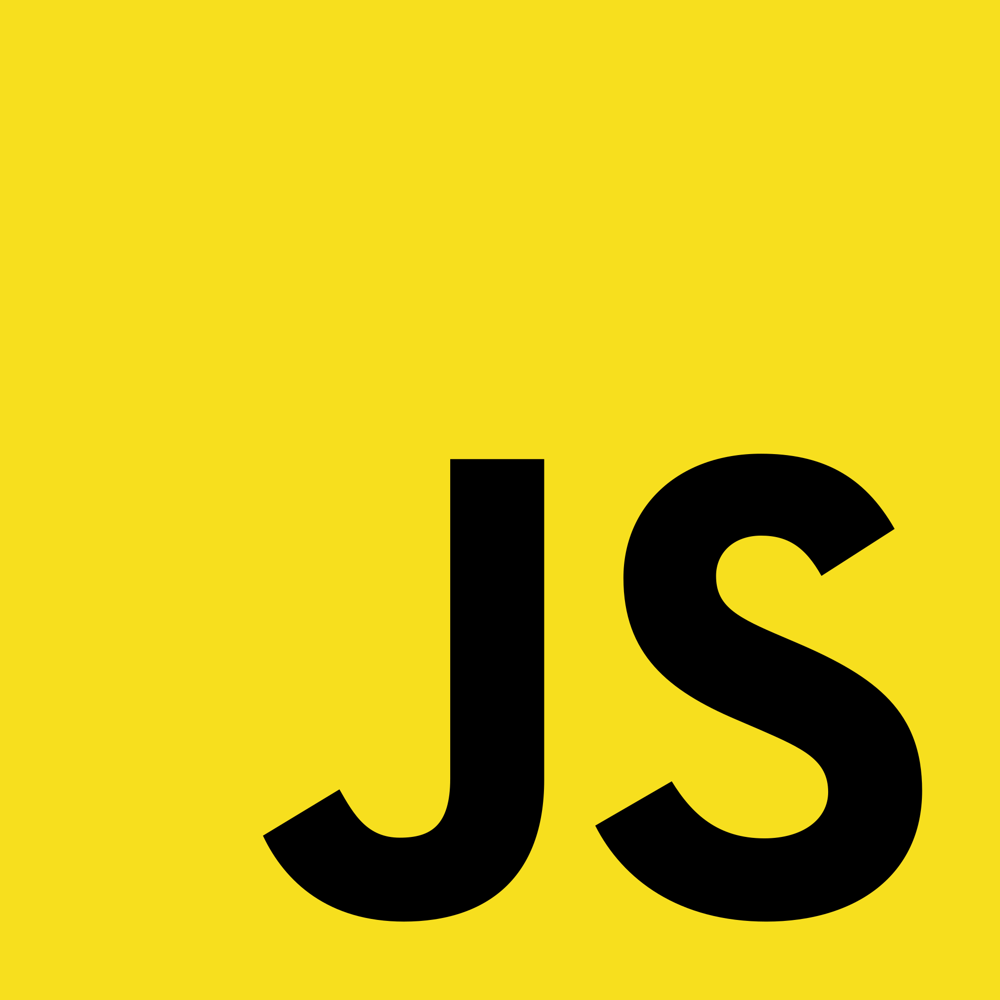

<h1 align="center">
  
</h1>
   
###    About Me:

  Hi, I am Christopher Tscheschlog! A pragmatic programmer from Pennsylvania
   
   
  👨‍🎓 I have a Bachelor's degree from Florida Gulf Coast University in Software Engineering
   
  💻 I love Writing code, building hardware and learning anything inbetween 😊
   
  📚 I’m currently focusing on Full-Stack and XR 
   
  📫 How to reach me 👇

   

<h2 align="center">🔥 Languages & Frameworks & Tools & Abilities 🔥</h2> 

  <code></code>
  <code></code>
  <code></code>
  <code></code>
  <code></code>
  <code></code>
  <code></code>
  <code></code>
  <code></code>
  <code></code>
  <code></code>
  <code></code>
  <code></code>
  <code></code>

<h2 align="center">⚡ Stats ⚡</h2>
 

<h2 align="center">💹 Popular Languages 💹</h2>
 

   
  

